# goforeat （新版本更名为有得食）
有得食 外卖软件 （react native架构）

  

### 附录
ios的打包方法:
[https://www.jianshu.com/p/b1b77d804254](https://www.jianshu.com/p/b1b77d804254)  
android的打包方法:
[https://www.jianshu.com/p/61e27d9b02f2](https://www.jianshu.com/p/61e27d9b02f2)
### android平台 [android 下载地址](https://play.google.com/store/apps/details?id=com.goforeat_app)
* 运行: 用Android studio导入android文件夹下的项目 -> run 
* 打包: 在项目文件夹下, $ cd android && ./gradlew assembleRelease

### ios平台 [ios 下载地址](https://itunes.apple.com/cn/app/goforeat/id1343559475?mt=8)
* 运行: Xcode(打开goforeat_app.xcworkspace项目) -> run
* 打包:
    * 使用离线数据:取消注释jsCodeLocation = [[NSBundle mainBundle] ...这一行
    * 选择'Generic iOS Device'
    * Product->Archive
    
### v 1.1.4 增加推送 集成热更新
 

  
  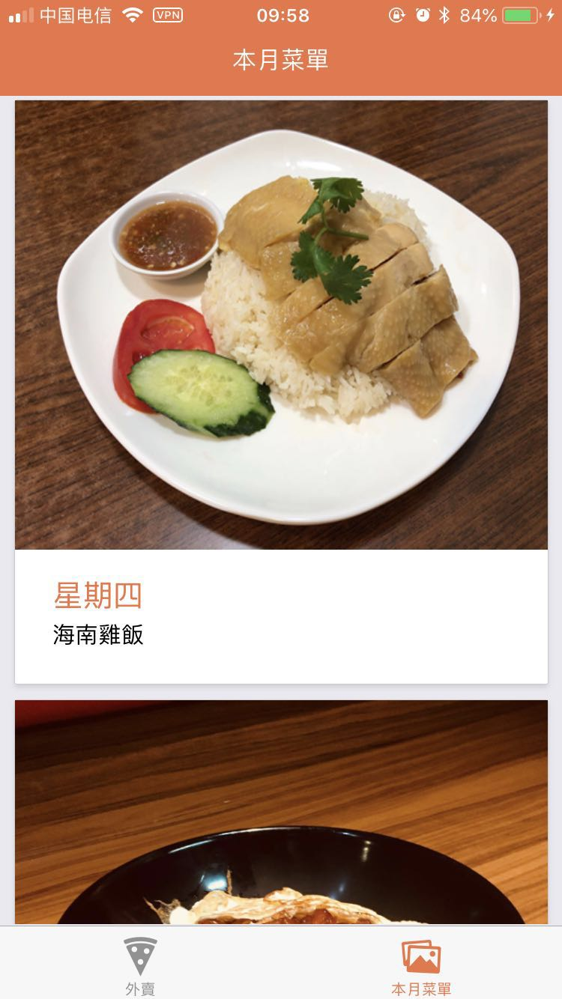
  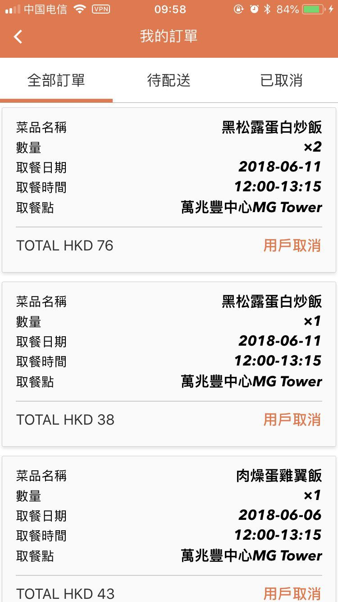

  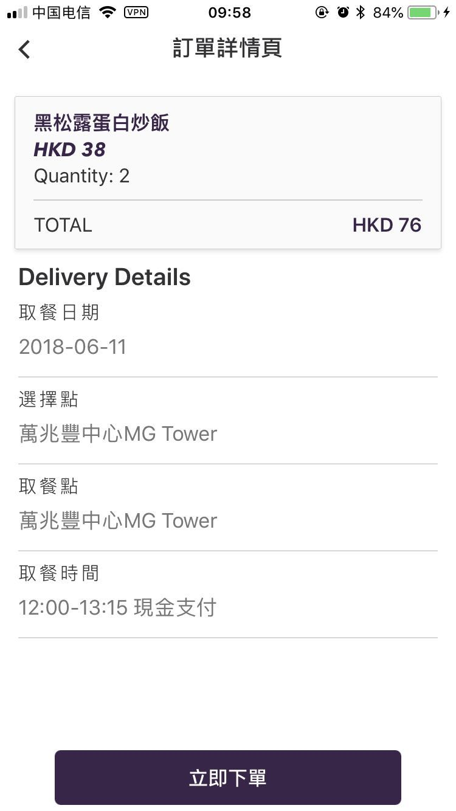
  
  

  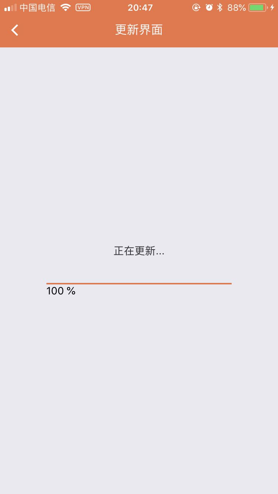
  
  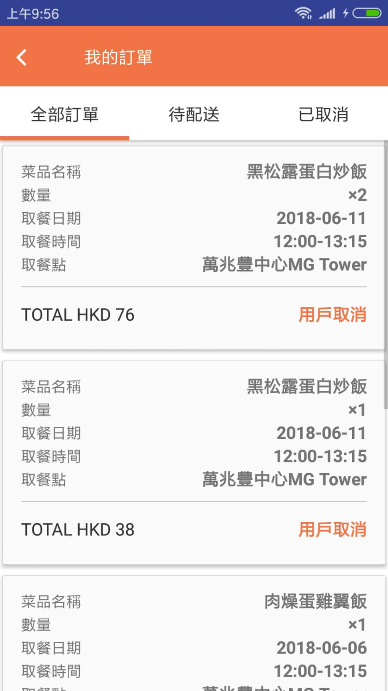

  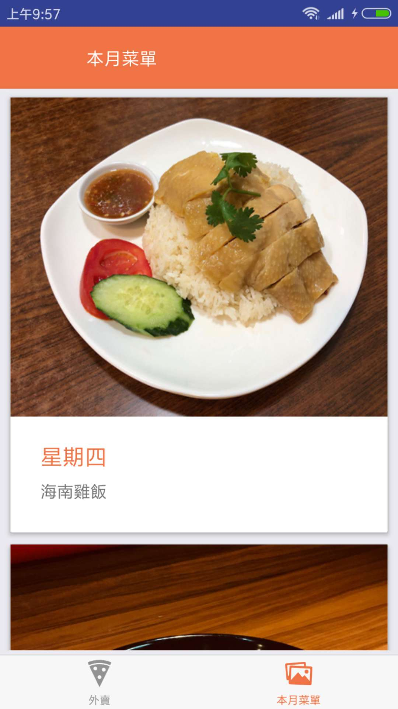
  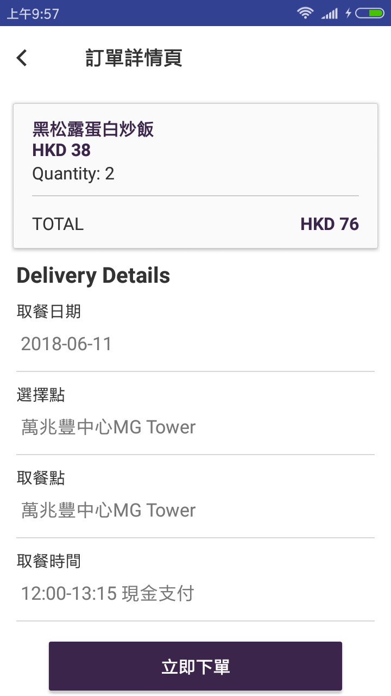

### 过往版本截图  
- 商品页
- 侧边栏
- 详情页
- 登录页
- 设置页
- 推荐页
- 积分详情页
- 我的关注页

  
  
  

  
  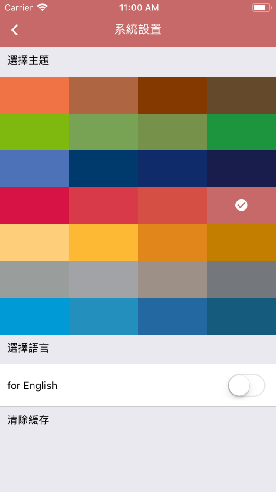
  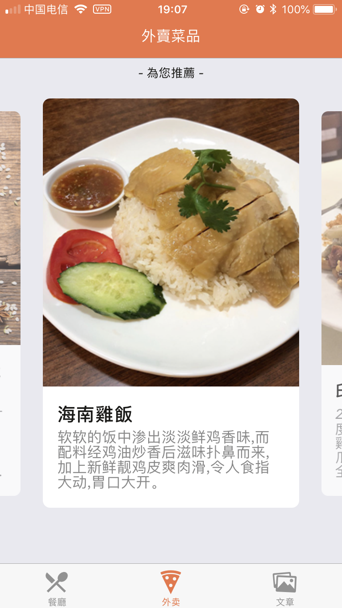

  
  
  

  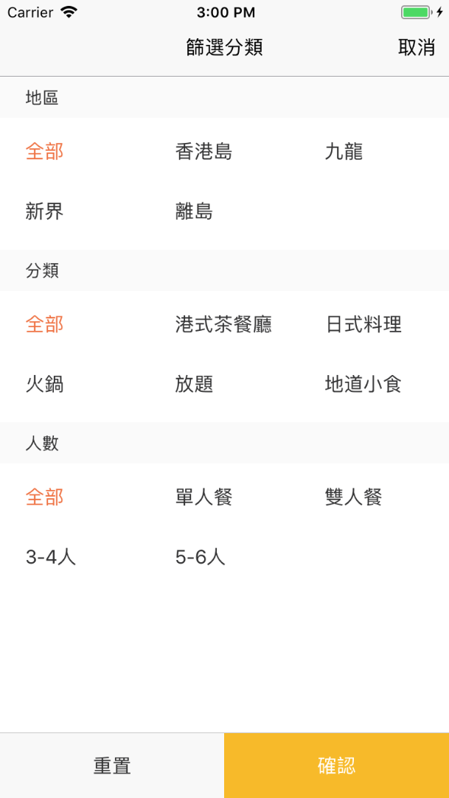
  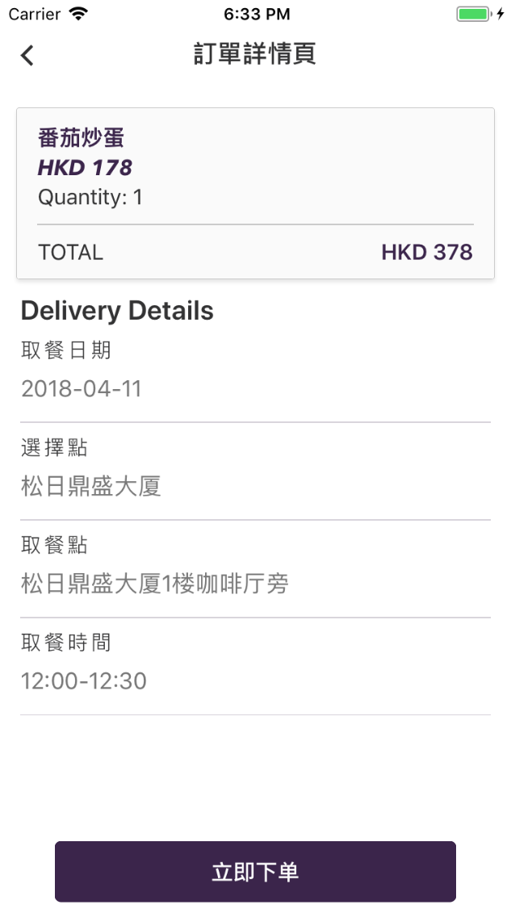
  

### screen shot 

  
  
  

  
  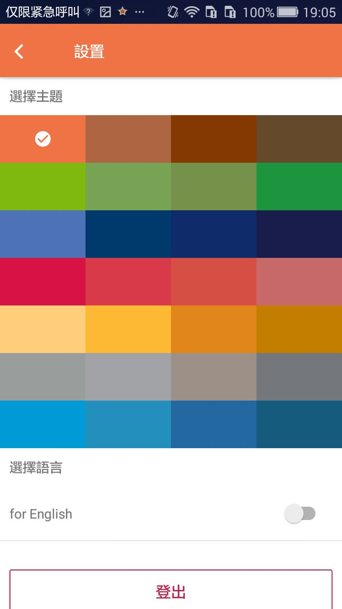
  

  
  
  

  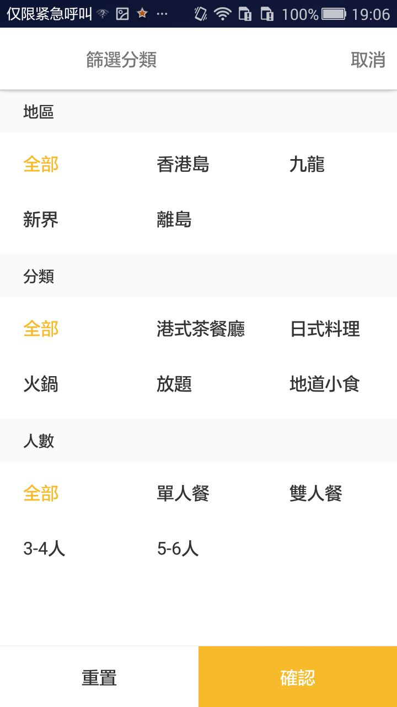
  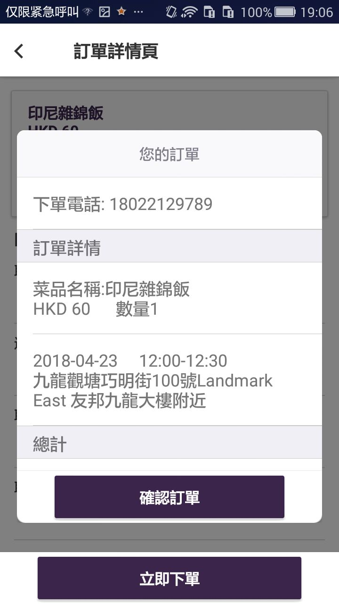
  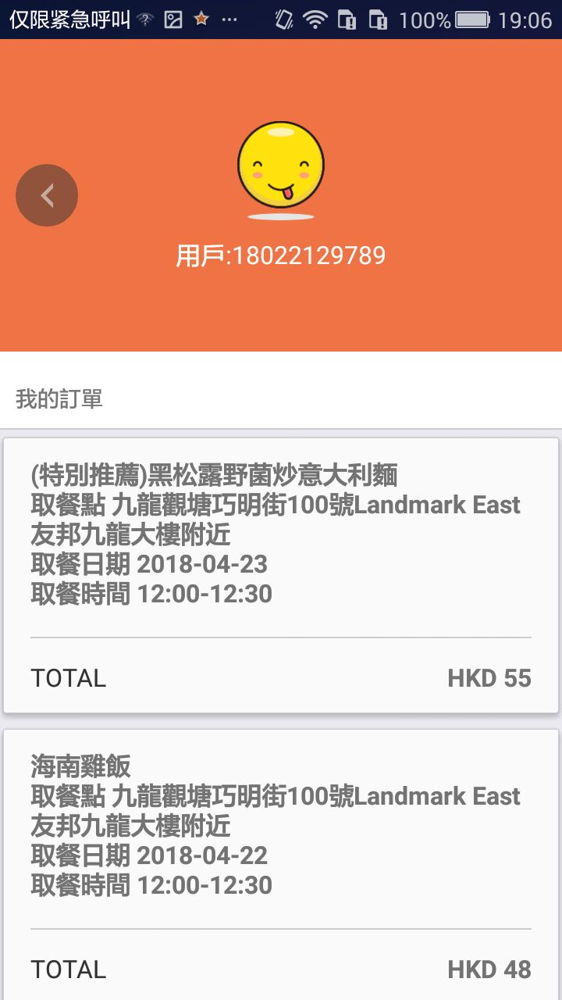

# goforeat_website
使用vue框架架构

  

  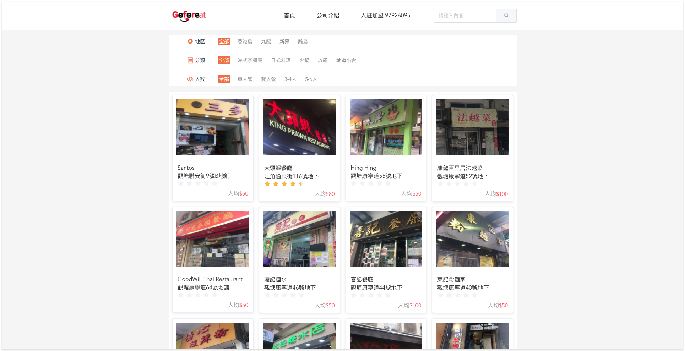

