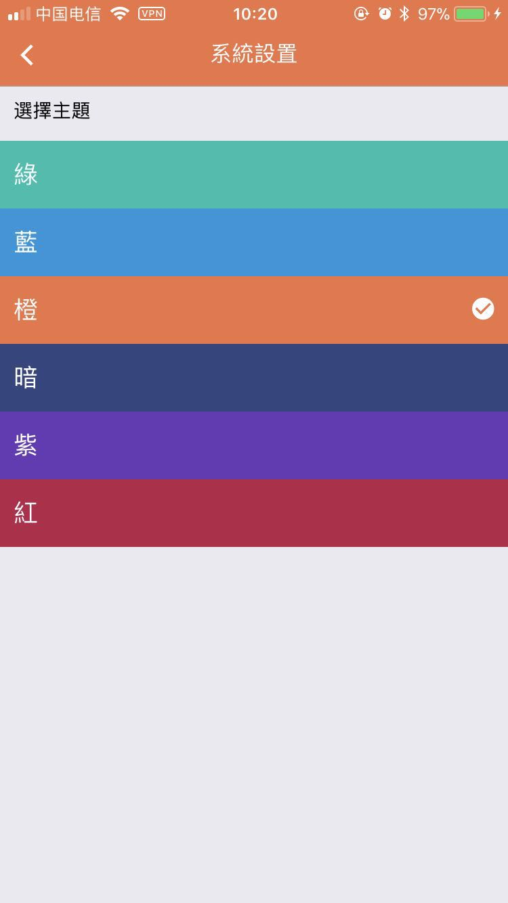

# goforeat_app
goforear 外卖软件 （react native架构）

  

### 附录
ios的打包方法:
[https://www.jianshu.com/p/b1b77d804254](https://www.jianshu.com/p/b1b77d804254)

### screen shot   [ios 下载地址](https://itunes.apple.com/cn/app/goforeat/id1343559475?mt=8)
- 商品页
- 侧边栏
- 详情页
- 登录页
- 设置页
- 推荐页
- 积分详情页
- 我的关注页

  
  
  

  
  
  

  
  

### screen shot android

  
  

  
  

  
  

