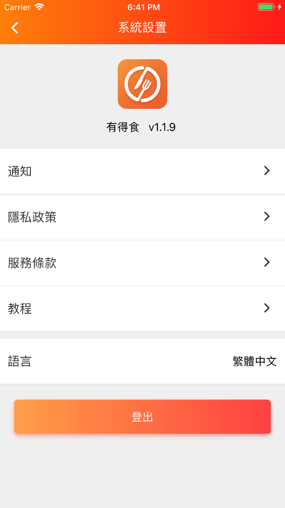

# goforeat （新版本更名为有得食）
有得食 外卖软件 （react native架构）

  

### android平台 [android 下载地址](https://play.google.com/store/apps/details?id=com.goforeat_app)
* 运行: 用Android studio导入android文件夹下的项目 -> run 
* 打包: 在项目文件夹下, npm run bundle-android 打包完bundle后 $ cd android && ./gradlew assembleRelease

### ios平台 [ios 下载地址](https://itunes.apple.com/cn/app/goforeat/id1343559475?mt=8)
* 运行: Xcode(打开goforeat_app.xcworkspace项目) -> run
* 打包:
    * 选择'Generic iOS Device'
    * Product->Archive

### v 1.2.0 概览 
1、全新登錄頁和訂單頁
2、支持線上信用卡支付
3、訂單詳情可添加備註留言
4、首頁添加查看詳情功能
5、支持多语言  兼容iPhone X
 

  
  
  
  

  
  
  
  

  
  
  
  

### 附录
ios的打包方法:
[https://www.jianshu.com/p/b1b77d804254](https://www.jianshu.com/p/b1b77d804254)  
android的打包方法:
[https://www.jianshu.com/p/61e27d9b02f2](https://www.jianshu.com/p/61e27d9b02f2)

# goforeat_website
使用vue框架架构 现已不再维护

  

  

