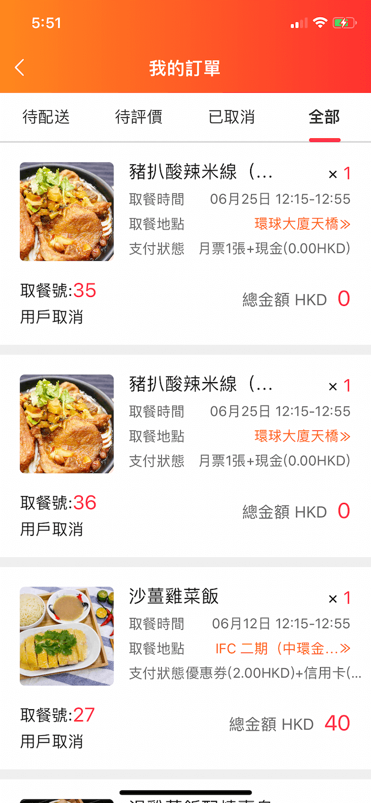
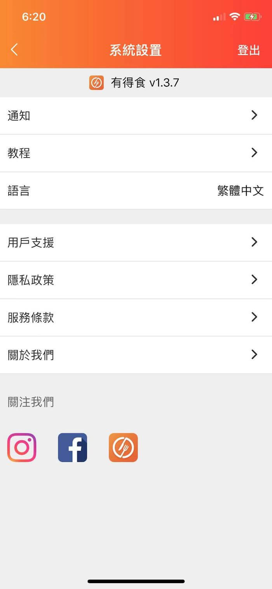

  

<h3 align="center">goforeat mealtime 有得食开源app</h3>

## 文檔結構

点击展开查看

<pre><code>
app  
├── actions                                                     actions
│   └── index.js                                                需要處理的actions別名
├── animations                                                  lottie動畫庫
├── api                                                         請求方法
├── asset                                                       圖標
├── cache                                                       cache
│   └── appStorage.js                                           app中的緩存
├── components                                                  組件
│   ├── AdvertiseView.js                                        廣告頁
│   ├── BlankPage.js                                            空白頁提示
│   ├── BottomIntroduce.js                                      底部介紹
│   ├── CommonBottomBtn.js                                      底部確認按鈕
│   ├── CommonComment.js                                        評論組件
│   ├── CommonFlatList.js                                       公用flatlist
│   ├── CommonHeader.js                                         app公用navbar
│   ├── CommonItem.js                                           app公用列表item
│   ├── CommonModal.js                                          app公用modal
│   ├── CustomDrawer.js                                         抽屜組件
│   ├── CustomizeContainer.js                                   公用的處理iPhone適配組件
│   ├── CustomLoading.js                                        指示器組件
│   ├── Divider.js                                              間隔組件
│   ├── ErrorPage.js                                            錯誤頁組件
│   ├── Guider.js                                               導航組件
│   ├── ImageGellery.js                                         圖片瀏覽
│   ├── ListFooter.js                                           列表上拉顯示狀態組件
│   ├── Loading.js                                              整屏加載組件
│   ├── LoadingModal.js                                         加載modal
│   ├── OnlineBuyingModel.js                                    線上支付彈出組件(信用卡,apple pay)
│   ├── PannelBottom.js                                         從底部劃出組件
│   ├── PlacePickerModel.js                                     選擇地區modal
│   ├── PreviewPlaceImg.js                                      預覽選擇地區
│   ├── ShareComponent.js                                       分享朋友圈或者WhatsApp
│   ├── ShimmerPlaceholder.js                                   加載佔位符
│   ├── SliderEntry.js                                          首屏滾動圖片組件
│   ├── SlideUpPanel.js                                         向上滾動組件
│   ├── Swiper.js                                               圖片輪播組件
│   ├── Tabbar.js                                               自定義tabbar
│   ├── UnScalingText.js                                        不允許系統放大字體Text
│   ├── VersionController.js                                    codepush更新控制
│   └── WarningTips.js                                          首頁公告組件
├── hoc                                                         高階組件
│   └── CommonHOC.js                                            公共高階組件
├── language                                                    語言
│   ├── en.js                                                   英文
│   ├── i18n.js                                                 轉換(繁)英文
│   └── zh.js                                                   繁體中文
├── reducers                                                    reducers
│   └── appReducer.js                                           app中的reducers
├── store                                                       store
│   └── index.js                                                store的配置
├── styles                                                      app中的樣式
│   ├── common.style.js                                         公用樣式
│   ├── confirmorder.style.js                                   確認訂單樣式
│   ├── content.style.js                                        內容頁樣式
│   ├── coupon.style.js                                         優惠券樣式
│   ├── creditcard.style.js                                     信用卡樣式
│   ├── fooddetails.style.js                                    菜單詳情頁樣式
│   ├── index.style.js                                          輪播樣式
│   ├── login.style.js                                          登錄頁樣式
│   ├── mainview.style.js                                       mainview樣式
│   ├── managecreditcard.style.js                               管理信用卡樣式
│   ├── myorder.style.js                                        我的訂單樣式
│   ├── paysetting.style.js                                     支付方式樣式
│   ├── purchasemonthticket.style.js                            購買月票樣式
│   ├── SliderEntry.style.js                                    輪播樣式
│   └── userinfo.style.js                                       用戶詳情樣式
├── utils                                                       工具
│   ├── animations.js                                           動畫庫
│   ├── BackAndroidHandler.js                                   安卓返回處理
│   ├── CodePushUtils.js                                        codepush熱更新
│   ├── Colors.js                                               顏色
│   ├── DeviceInfo.js                                           手機詳細信息
│   ├── FormatCardInfo.js                                       格式化卡片
│   ├── global_params.js                                        全局配置參數
│   ├── JSONUtils.js                                            json處理工具
│   ├── LinkingUtils.js                                         打電話工具
│   ├── NavigationService.js                                    自定義路由跳轉
│   ├── TextUtils.js                                            字體
│   ├── ToastUtil.js                                            toast工具
│   └── ViewStatus.js                                           頁面狀態
├── views                                                       頁面
│   ├── ConfirmOrderView.js                                     確認訂單頁面
│   ├── ContentView.js                                          內容頁
│   ├── CouponView.js                                           優惠券頁面
│   ├── CreditCardView.js                                       信用卡頁面
│   ├── FeedbackView.js                                         反饋頁
│   ├── FoodDetailsView.js                                      菜品詳情頁面
│   ├── FoodListView.js                                         餐單預告頁面
│   ├── ManageCreditCardView.js                                 管理信用卡頁面
│   ├── MyOrderView.js                                          我的訂單頁
│   ├── PaySettingView.js                                       支付方式頁面
│   ├── PickPlaceView.js                                        瀏覽選擇地區頁面
│   ├── PurchaseMonthTicket.js                                  購買月票頁面
│   ├── StatementView.js                                        app里宣傳頁面
│   ├── UserHelperView.js                                       用戶支援頁面
│   └── UserInfoView.js                                         用戶詳情頁
├── CustomLoginView.js                                          登錄頁
├── DashBoardView.js                                            DashboardView(用于获取路由ref实例)
├── MainView.js                                                 MainView(整個app的路由配置)
├── MandatoryUpdateView.js                                      熱更新下載進度頁
├── permission.js                                               登录权限配置
└── SettingView.js                                              系統設置頁
</code></pre>

## v 1.3.7 概覽

 

  
  
  
  

  
  
  
  

  
  
  
  

## 更多

- [有得食介绍](https://github.com/syun0216/goforeat/tree/master/more/有得食介绍.md)
- [项目构建遇到的问题](https://github.com/syun0216/goforeat/tree/master/more/项目构建遇到的问题.md)
- [项目小技巧](https://github.com/syun0216/goforeat/tree/master/more/项目小技巧.md)
- [update-to-0.59.8](https://github.com/syun0216/goforeat/tree/master/more/update-to-0.59.8.md)
- [codepush 热更新gif效果](https://github.com/syun0216/goforeat/tree/master/display/codepush.gif)

## 附錄

- ios的打包方法:
[https://www.jianshu.com/p/b1b77d804254](https://www.jianshu.com/p/b1b77d804254)  
- android的打包方法:
[https://www.jianshu.com/p/61e27d9b02f2](https://www.jianshu.com/p/61e27d9b02f2)

## 参考

- react-native官网:[https://facebook.github.io/react-native/](https://facebook.github.io/react-native/)    
- react-native中文网:[https://reactnative.cn/](https://reactnative.cn/)  
- react-navigation:[https://reactnavigation.org/en/](https://reactnavigation.org/en/)  
- react-native 动画教程:[https://www.tuicool.com/articles/BJ7JbaY](https://www.tuicool.com/articles/BJ7JbaY)  
- native-base:[https://nativebase.io](https://nativebase.io)  
- teaset:[https://github.com/rilyu/teaset](https://github.com/rilyu/teaset)  
- upgrade-rn-app:[https://react-native-community.github.io/upgrade-helper/](https://react-native-community.github.io/upgrade-helper/)  
- safeAreaView详解:[https://blog.csdn.net/xiangzhihong8/article/details/80692792](https://blog.csdn.net/xiangzhihong8/article/details/80692792)  
- code-push 热更新教程:[https://bbs.reactnative.cn/topic/725](https://bbs.reactnative.cn/topic/725/code-push-%E7%83%AD%E6%9B%B4%E6%96%B0%E4%BD%BF%E7%94%A8%E8%AF%A6%E7%BB%86%E8%AF%B4%E6%98%8E%E5%92%8C%E6%95%99%E7%A8%8B)  
- 项目参考:[https://juejin.im/post/58f37cb361ff4b0058f9824a](https://juejin.im/post/58f37cb361ff4b0058f9824a)  
