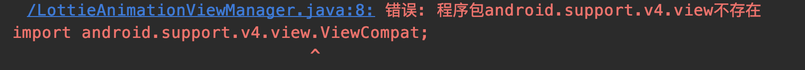

## 启动项目教程

### Android

1. 已经安装过的同学，拉取最新代码，请rm -rf node_modules后进行重新安装
2. 在terminal中打开项目根目录，运行 npm i 
3. 用android studio打开根目录下的android文件夹，下载必要的包，此过程可能会比较久
4. 由于项目中开启里androidx相关配置，具体配置在gradle.properties中,所以运行时可能会报错
```
android.useAndroidX=true
android.enableJetifilter= true
```



5. 这时我们需要手动把安装包的改成androidx的写法，对应写法如下，大家可以全局替换一下：

```java
import android.support.v4.view.ViewCompat; -> import androidx.core.view.ViewCompat;
import android.support.annotation.NonNull; -> import androidx.annotation.NonNull;
import android.support.annotation.Nullable; -> import androidx.annotation.Nullable;
import android.support.annotation.StyleRes; -> import androidx.annotation.StyleRes;
import android.support.v4.app.ActivityCompat; -> import androidx.core.app.ActivityCompat;
import android.support.v7.app.AlertDialog; -> import androidx.appcompat.app.AlertDialog;
import android.support.v4.content.FileProvider; -> import androidx.core.content.FileProvider;
import android.support.v4.content.CursorLoader; -> import androidx.loader.content.CursorLoader;
import android.support.annotation.RequiresApi; -> import androidx.annotation.RequiresApi;
import android.support.v4.content.ContextCompat; -> import androidx.core.content.ContextCompat;
import android.support.annotation.RequiresPermission; -> import androidx.annotation.RequiresPermission;
```
6. android跑的时候出现warning是因为有些命令已经过时了，比如compile需要替换为implementation,这个在android studio上有具体指出，大家可以自行修改
7. 若出现cn.jpush.reactnativejpush不存的错误，请参考jpush的[官方文档](https://github.com/jpush/jpush-react-native)
8. 如果出现Duplicate resources错误， 请在**node_modules/react-native/react.gradle**里添加以下方法：
```java
doLast {
    def moveFunc = { resSuffix ->
        File originalDir = file("${resourcesDir}/drawable-${resSuffix}");
        if (originalDir.exists()) {
            File destDir = file("$buildDir/../src/main/res/drawable-${resSuffix}");
            ant.move(file: originalDir, tofile: destDir);
        }
    }
    moveFunc.curry("ldpi").call()
    moveFunc.curry("mdpi").call()
    moveFunc.curry("hdpi").call()
    moveFunc.curry("xhdpi").call()
    moveFunc.curry("xxhdpi").call()
    moveFunc.curry("xxxhdpi").call()
}
```


### iOS

1. 在terminal中打开项目根目录，运行 npm i 
2. 安装cocoapods，然后在ios目录下运行 pod install
3. 使用xcode在根目录打开iOS目录下的goforeat_app.xcworkspace
4. 配置证书(由于证书比较机密，大家有证书就自己自行配置吧) 配置方法在[https://www.jianshu.com/p/b1b77d804254](https://www.jianshu.com/p/b1b77d804254)